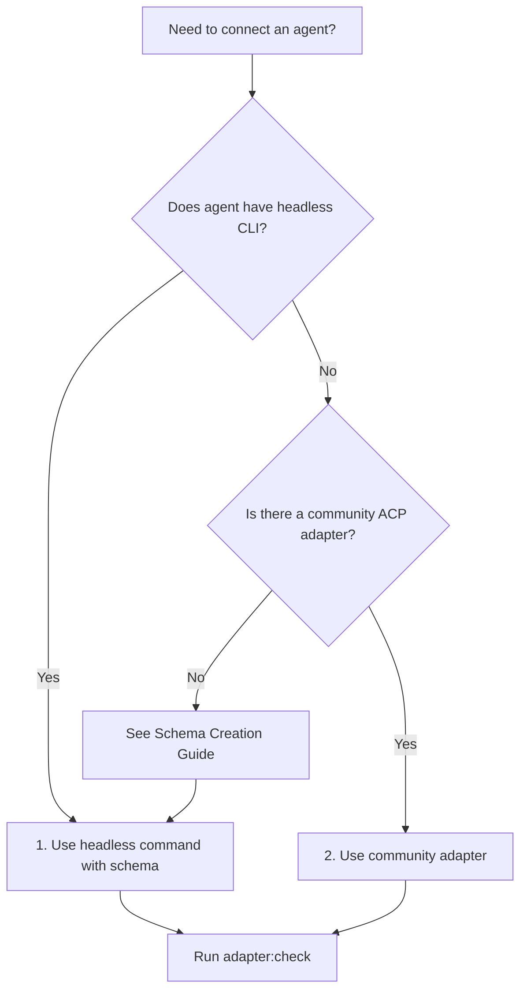
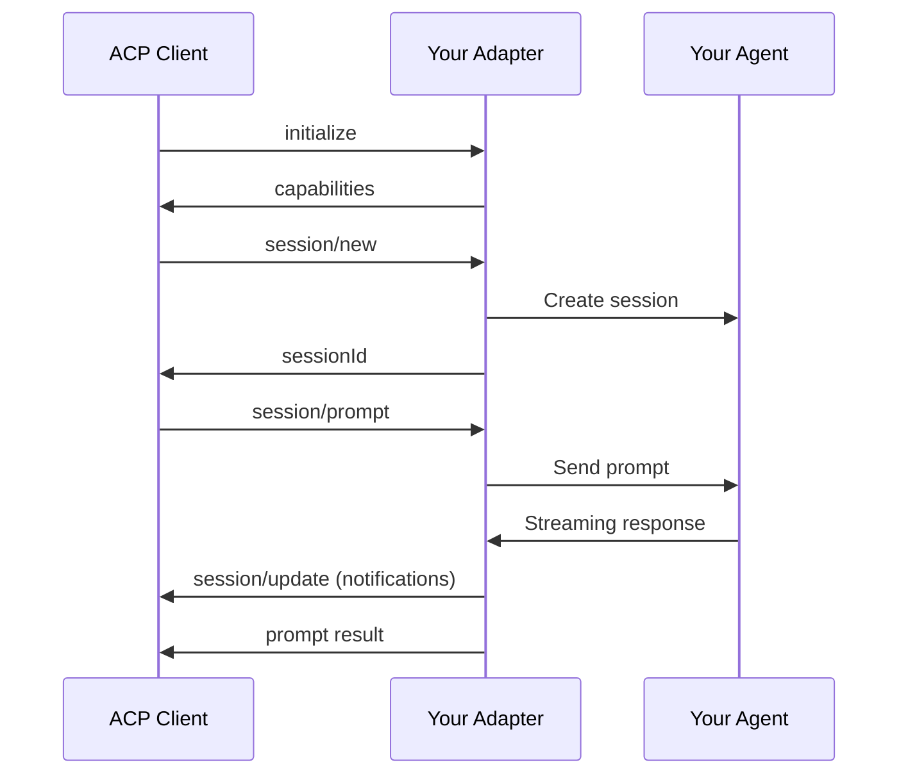

# ACP Adapters

## Purpose

This skill helps developers **integrate agents with ACP** (Agent Client Protocol). Whether you need to connect an existing adapter or build a custom one, this skill provides:

- **Discovery**: Find and evaluate existing adapters
- **Creation**: Scaffold new adapter projects with best practices
- **Validation**: Verify compliance with the ACP protocol specification

| Use Case | Tool | Description |
|----------|------|-------------|
| Wrap headless CLI agent | `headless` command | Schema-driven adapter for any CLI (**recommended**) |
| Connect existing agent | [Adapter Catalog](references/adapter-catalog.md) | Curated list of production adapters |
| Verify implementation | `adapter:check` command | Validate protocol compliance |
| Create new schemas | [Schema Creation Guide](references/schema-creation-guide.md) | Step-by-step workflow for new agents |

## Quick Decision Tree

> **Most coding agents support headless CLI modes with JSON output - try this first!**



## CLI Commands

### headless

Schema-driven ACP adapter for ANY headless CLI agent. No code required - just define a JSON schema describing how to interact with the CLI.

```bash
bunx @plaited/acp-harness headless --schema <path>
```

**Options:**
| Flag | Description | Required |
|------|-------------|----------|
| `-s, --schema` | Path to adapter schema (JSON) | Yes |

**Why Use Headless?**

| Scenario | Solution |
|----------|----------|
| Agent has CLI but no ACP | Create schema, run headless |
| Agent's ACP mode lacks features | Use headless CLI mode instead |
| Quick prototyping | Schema-only, no code to write |

**Schema Format:**

```json
{
  "version": 1,
  "name": "my-agent",
  "command": ["my-agent-cli"],
  "sessionMode": "stream",
  "prompt": { "flag": "-p" },
  "output": { "flag": "--output-format", "value": "stream-json" },
  "autoApprove": ["--allow-all"],
  "outputEvents": [
    {
      "match": { "path": "$.type", "value": "message" },
      "emitAs": "message",
      "extract": { "content": "$.text" }
    }
  ],
  "result": {
    "matchPath": "$.type",
    "matchValue": "result",
    "contentPath": "$.content"
  }
}
```

**Session Modes:**

| Mode | Description | Use When |
|------|-------------|----------|
| `stream` | Keep process alive, multi-turn via stdin | CLI supports session resume |
| `iterative` | New process per turn, accumulate history | CLI is stateless |

**Examples:**

```bash
# Run with Claude headless schema
ANTHROPIC_API_KEY=... bunx @plaited/acp-harness headless --schema .claude/skills/acp-adapters/schemas/claude-headless.json

# Run with Gemini headless schema
GEMINI_API_KEY=... bunx @plaited/acp-harness headless --schema .claude/skills/acp-adapters/schemas/gemini-headless.json

# Use in capture pipeline
bunx @plaited/acp-harness capture prompts.jsonl \
  bunx @plaited/acp-harness headless --schema ./my-schema.json \
  -o results.jsonl

# Validate adapter compliance
bunx @plaited/acp-harness adapter:check \
  bunx @plaited/acp-harness headless --schema ./my-schema.json
```

**Pre-built Schemas:**

Pre-built schemas are available in [schemas/](schemas/):

| Schema | Agent | Mode | Auth Env Var | Notes |
|--------|-------|------|--------------|-------|
| `claude-headless.json` | Claude Code | stream | `ANTHROPIC_API_KEY` | Uses `-p` flag, supports resume |
| `gemini-headless.json` | Gemini CLI | iterative | `GOOGLE_API_KEY` | Uses `--prompt` flag |

> **Note:** Only schemas with passing E2E tests are included. See [Schema Creation Guide](references/schema-creation-guide.md) for creating schemas for other agents.

**Using Schemas from Installed Skills:**

When this skill is installed in a project, agents can reference schemas directly using the path from project root:

```bash
# Path pattern: .{agent}/skills/acp-adapters/schemas/{schema}.json
bunx @plaited/acp-harness headless --schema .claude/skills/acp-adapters/schemas/claude-headless.json
bunx @plaited/acp-harness headless --schema .cursor/skills/acp-adapters/schemas/gemini-headless.json
```

The skill's `Base directory` (shown when the skill is activated) provides the exact path to the schemas directory.

---

### adapter:check

Validate that an adapter implements the ACP protocol correctly.

```bash
bunx @plaited/acp-harness adapter:check <command> [args...]
```

**Options:**
| Flag | Description | Default |
|------|-------------|---------|
| `--timeout` | Timeout for each check in ms | `5000` |
| `--verbose` | Show detailed protocol messages | false |

**Checks Performed:**

| Check | Description |
|-------|-------------|
| `spawn` | Adapter can be launched as subprocess |
| `initialize` | Responds to initialize with valid `agentCapabilities` |
| `session/new` | Creates session and returns `sessionId` |
| `session/prompt` | Accepts prompt and emits `session/update` notifications |
| `session/cancel` | Accepts cancel notification gracefully |
| `framing` | All messages are newline-delimited JSON-RPC 2.0 |

**Example:**

```bash
# Check a local adapter
bunx @plaited/acp-harness adapter:check bun ./my-adapter/src/main.ts

# Check with verbose output
bunx @plaited/acp-harness adapter:check bunx my-published-adapter --verbose

# Check with longer timeout
bunx @plaited/acp-harness adapter:check python ./adapter.py --timeout 10000
```

**Sample Output:**

```
Checking ACP compliance for: bun ./my-adapter/src/main.ts

✓ spawn: Adapter launched successfully
✓ initialize: Protocol version 1, capabilities: loadSession, promptCapabilities.image
✓ session/new: Session sess_abc123 created
✓ session/prompt: Received 3 updates (thought, tool_call, message)
✓ session/cancel: Acknowledged without error
✓ framing: All messages valid JSON-RPC 2.0

6/6 checks passed. Adapter is ACP-compliant.
```

## Protocol Overview

ACP (Agent Client Protocol) uses **JSON-RPC 2.0 over stdio** for client-agent communication. An adapter translates between your agent's API and the ACP protocol.



### Required Methods

| Method | Type | Description |
|--------|------|-------------|
| `initialize` | request | Protocol handshake, returns capabilities |
| `session/new` | request | Create conversation session |
| `session/prompt` | request | Send prompt, receive response |
| `session/cancel` | notification | Cancel ongoing prompt |
| `session/update` | notification (outgoing) | Stream updates to client |

See [Protocol Quick Reference](references/protocol-quick-ref.md) for complete method signatures.

## Getting Started

### Option 1: Use Headless Adapter (Recommended)

Most modern coding agents support headless CLI modes with JSON output. This is the **simplest** approach - just a schema file, no code required.

1. **Check if a schema already exists** in [schemas/](schemas/):
   ```bash
   ls .claude/skills/acp-adapters/schemas/
   ```

2. **If a schema exists, run it:**
   ```bash
   # Example: Claude Code
   ANTHROPIC_API_KEY=... bunx @plaited/acp-harness headless --schema .claude/skills/acp-adapters/schemas/claude-headless.json
   ```

3. **If no schema exists, create one** using the [Schema Creation Guide](references/schema-creation-guide.md).

4. **Validate compliance:**
   ```bash
   bunx @plaited/acp-harness adapter:check bunx @plaited/acp-harness headless --schema ./my-agent-schema.json
   ```

5. **Capture trajectories:**
   ```bash
   bunx @plaited/acp-harness capture prompts.jsonl \
     bunx @plaited/acp-harness headless --schema ./my-agent-schema.json \
     -o results.jsonl
   ```

### Option 2: Use Existing Adapter

Check the [Adapter Catalog](references/adapter-catalog.md) for your agent:

```bash
# Claude Code (official)
bunx @zed-industries/claude-code-acp

# Gemini CLI (built-in ACP mode)
gemini --experimental-acp

# See catalog for more
```

## References

| Document | Description |
|----------|-------------|
| [adapter-catalog.md](references/adapter-catalog.md) | Curated list of existing adapters |
| [schema-creation-guide.md](references/schema-creation-guide.md) | Workflow for creating headless schemas |
| [protocol-quick-ref.md](references/protocol-quick-ref.md) | ACP protocol cheat sheet |
| [implementation-guide.md](references/implementation-guide.md) | Step-by-step adapter creation |

## Related

- **[@agentclientprotocol/sdk](https://www.npmjs.com/package/@agentclientprotocol/sdk)** - ACP SDK with TypeScript types
- **[acp-harness skill](../acp-harness/SKILL.md)** - Running evaluations against adapters
- **[ACP Specification](https://agentclientprotocol.org)** - Official protocol documentation
