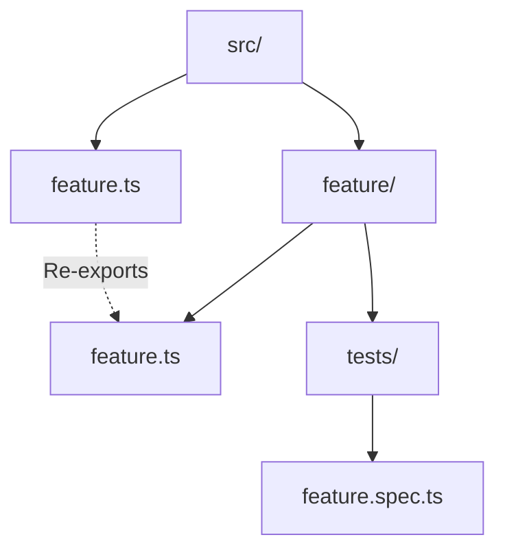

# AGENTS.md

Agent guidance for this repository.

## Overview

General-purpose eval harness for running trials against CLI agents. Executes prompts via adapter scripts, captures trajectories (thoughts, tool calls, messages), grades outputs, and writes JSONL results.

## Capabilities

- **Multi-turn**: `input: string | string[]` executes sequentially in same session
- **Isolation**: Fresh session per JSONL entry
- **Parallelization**: Concurrency control via worker pool
- **Workspace isolation**: Creates per-prompt directories for adapter execution
- **Polyglot adapters**: TS/JS modules (import `adapt` function) or executable scripts (stdin/stdout JSON protocol)
- **Polyglot graders**: TS/JS modules (import `grade` function) or executable scripts
- **pass@k metrics**: Multiple trials per prompt with statistical aggregation

## Structure

```
src/
├── cli.ts             # Unified CLI entry point (trials/compare/calibrate)
├── cli.utils.ts       # Shared CLI parsing utilities
├── trial.ts           # Trial runner library + CLI handler
├── trial.schemas.ts   # Zod schemas (single source of truth)
├── trial.utils.ts     # Loaders, worker pool, trajectory analysis
├── trial.constants.ts # Default timeout, default k
└── tests/
    └── trial.spec.ts  # Trial runner tests

.agents/skills/
├── trial-runner/      # Running trials with adapters
├── trial-adapters/    # Writing adapter scripts
└── compare-trials/    # Statistical comparison of trial results
```

## Commands

| Command | Purpose |
|---------|---------|
| `bun install` | Setup (requires bun >= v1.2.9) |
| `bun run check` | Type/lint/format check |
| `bun run check:write` | Auto-fix lint/format |
| `bun test src/` | Unit tests |

## CLI

```bash
bunx @plaited/agent-eval-harness trials '{"adapterPath": "./adapter.ts", "promptsPath": "./prompts.jsonl", "k": 3}'
```

| Subcommand | Status | Purpose |
|------------|--------|---------|
| `trials` | Implemented | Run trials against an adapter with optional grading |
| `compare` | Stub | Statistical comparison of trial results |
| `calibrate` | Stub | Grader calibration |

## Package Exports

| Import Path | What It Exports |
|------------|----------------|
| `@plaited/agent-eval-harness` | `runTrial`, `calculatePassAtK`, `calculatePassExpK`, `trialCli` |
| `@plaited/agent-eval-harness/schemas` | All Zod schemas and types (`Grader`, `Adapter`, `TrajectoryStep`, etc.) |

## Skills

| Skill | Use Case |
|-------|----------|
| **trial-runner** | Running trials with adapters, interpreting results |
| **trial-adapters** | Writing adapter scripts for different agents |
| **compare-trials** | Statistical comparison of trial result sets |

## Constraints

- **Bun required**: >= v1.2.9
- **ES2024**: Uses modern APIs

## Verification

**Before commit:**
- `bun run check` passes
- `bun test src/` passes
- No `--no-verify` on git commits

<!-- PLAITED-RULES-START -->

## Rules

# Bun APIs

**Prefer Bun over Node.js** when running in Bun environment.

**File system:**
- `Bun.file(path).exists()` not `fs.existsSync()`
- `Bun.file(path).text()` not `readFileSync()`
- `Bun.write(path, data)` not `writeFileSync()`
*Verify:* `grep 'from .node:fs' src/`
*Fix:* Replace with Bun.file/Bun.write

**When Node.js OK:** `appendFile` (no Bun async append equivalent), `mkdir` with `{ recursive: true }`, `node:path` utilities

**Shell commands:**
- `Bun.$\`cmd\`` not `child_process.spawn()`
*Verify:* `grep 'child_process' src/`
*Fix:* Replace with Bun.$ template literal

**Path resolution:**
- `Bun.resolveSync()` for module resolution
- `import.meta.dir` for current directory
- Keep `node:path` for join/resolve/dirname
*Verify:* Check for `process.cwd()` misuse

**Executables:**
- `Bun.which(cmd)` to check if command exists
- `Bun.$\`bun add pkg\`` for package management

**Docs:** https://bun.sh/docs


# Workflow

## Git Commits

**Conventional commits** - `feat:`, `fix:`, `refactor:`, `docs:`, `chore:`, `test:`
**Multi-line messages** - Use for detailed context
**Never --no-verify** - Fix the issue, don't bypass hooks
*Verify:* Check git log format

## GitHub CLI

**Use `gh` over WebFetch** - Better data access, auth, private repos

**PR evaluation** - Fetch ALL sources:
```bash
# 1. Comments/reviews
gh pr view <n> --repo <owner>/<repo> --json title,body,comments,reviews,state

# 2. Security alerts
gh api repos/<owner>/<repo>/code-scanning/alerts

# 3. Inline comments
gh api repos/<owner>/<repo>/pulls/<n>/comments
```

**PR checklist:**
- [ ] Human reviewer comments
- [ ] AI code review comments
- [ ] Security alerts (ReDoS, injection)
- [ ] Code quality comments
- [ ] Inline suggestions

**URL patterns:**
| URL | Command |
|-----|---------|
| `github.com/.../pull/<n>` | `gh pr view <n> --repo ...` |
| `github.com/.../issues/<n>` | `gh issue view <n> --repo ...` |
| `.../security/code-scanning/<id>` | `gh api .../code-scanning/alerts/<id>` |

**Review states:** `APPROVED`, `CHANGES_REQUESTED`, `COMMENTED`, `PENDING`


# Module Organization

**No index.ts** - Never use index files, they create implicit magic
*Verify:* `find . -name 'index.ts'`
*Fix:* Rename to feature name: `feature/index.ts` → `feature.ts` at parent level

**Explicit .ts extensions** - `import { x } from './file.ts'` not `'./file'`
*Verify:* `grep "from '\./.*[^s]'" src/` (imports without .ts)
*Fix:* Add `.ts` extension

**Re-export at boundaries** - Parent `feature.ts` re-exports from `feature/feature.ts`



**File organization within modules:**
- `feature.types.ts` - Type definitions only
- `feature.schemas.ts` - Zod schemas + `z.infer<>` types
- `feature.constants.ts` - Constants, error codes
- `feature.ts` - Main implementation

**Direct imports** - Import from specific files, not through re-exports within module
*Verify:* Check for circular imports
*Fix:* Import directly: `from './feature.types.ts'` not `from './feature.ts'`


# Testing

**Use test not it** - `test('description', ...)` instead of `it('...')`
*Verify:* `grep '\bit(' src/**/*.spec.ts`
*Fix:* Replace `it(` with `test(`

**No conditional assertions** - Never `if (x) expect(x.value)`
*Verify:* `grep 'if.*expect\|&&.*expect' src/**/*.spec.ts`
*Fix:* Assert condition first: `expect(x).toBeDefined(); expect(x.value)...`

**Test both branches** - Try/catch, conditionals, fallbacks need both paths tested
*Verify:* Review test coverage for error paths
*Fix:* Add test for catch block, else branch, fallback case

**Use real dependencies** - Prefer installed packages over mocks when testing module resolution
*Verify:* Review test imports for fake paths
*Fix:* Use actual package like `typescript`

**Organize with describe** - Group related tests in `describe('feature', () => {...})`
*Verify:* Check for flat test structure
*Fix:* Add describe blocks by category (happy path, edge cases, errors)

**Coverage checklist** - Happy path, edge cases, error paths, real integrations
*Verify:* Review test file completeness

**Run:** `bun test src/` before commit


# Accuracy

**95% confidence threshold** - Report uncertainty rather than guess

**Verification first** - Read files before stating implementation details
*Verify:* Did you read the file before commenting on it?

**When uncertain:**
- State the discrepancy clearly
- Explain why you can't confidently recommend a fix
- Present issue to user for resolution
- Never invent solutions

**Dynamic exploration:**
- Read tool for direct file verification
- Grep/Glob for content and pattern searches
- Prioritize live code over cached knowledge

**Agent-specific applications:**
- Documentation: Only update TSDoc if types match current code
- Architecture: Verify patterns exist in codebase
- Code review: Read files before commenting
- Patterns: Confirm examples reflect actual usage


# Skill Activation

**Evaluate before implementing** - Check available skills for relevance before starting work

**Activation sequence:**

1. **Evaluate** - For each skill in `<available_skills>`, assess: `[skill-name] - YES/NO - [reason]`
2. **Activate** - Call `Skill(skill-name)` for each relevant skill before proceeding
3. **Implement** - Begin work only after activation is complete

*Verify:* Did you check available skills before starting implementation?
*Fix:* Pause, evaluate skills, activate relevant ones, then continue

**Activation before implementation** - Evaluating skills without calling `Skill()` provides no benefit
*Verify:* Check that `Skill()` was called for each YES evaluation
*Fix:* Call `Skill(skill-name)` for skipped activations


# Documentation

**TSDoc required** for public APIs

**Template:**
```typescript
/**
 * Brief description
 *
 * @remarks
 * Additional context
 *
 * @param options - Description
 * @returns Description
 *
 * @public
 */
```

**No @example** - Tests are living examples
**Use @internal** - Mark non-public APIs
**Mermaid only** - No ASCII box-drawing diagrams
*Verify:* `grep '[┌│└─]' *.md`


# Core Conventions

**Type over interface** - `type User = {` instead of `interface User {`
*Verify:* `grep 'interface [A-Z]' src/`
*Fix:* Replace `interface X {` with `type X = {`

**No any types** - Use `unknown` with type guards
*Verify:* `grep ': any' src/`
*Fix:* Replace `any` with `unknown`, add type guard

**PascalCase types** - `type UserConfig`, schemas get `Schema` suffix: `UserConfigSchema`
*Verify:* `lsp-find` for lowercase type names
*Fix:* Rename to PascalCase

**Arrow functions** - Prefer `const fn = () =>` over `function fn()`
*Verify:* `grep 'function \w' src/`
*Fix:* Convert to arrow function

**Object params >2 args** - `fn({ a, b, c }: { ... })` not `fn(a, b, c)`
*Exception:* CLI entry points take `args: string[]`
*Verify:* Review function signatures

**Private fields** - Use `#field` (ES2022) not `private field` (TypeScript)
*Verify:* `grep 'private \w' src/`
*Fix:* Replace `private x` with `#x`

**JSON imports** - `import x from 'file.json' with { type: 'json' }`

**@ts-ignore needs description** - `// @ts-ignore - reason here`

**Short-circuit/ternary OK** - `condition && doSomething()` is acceptable

**Mermaid diagrams only** - No ASCII box-drawing in markdown

**No @example in TSDoc** - Tests are living examples

<!-- PLAITED-RULES-END -->
